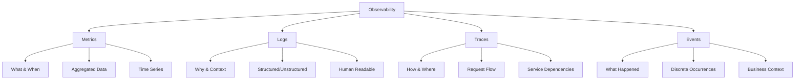

# Observability Deep Dive: A Comprehensive Guide

*A complete guide to understanding and implementing observability in modern systems*

## Table of Contents
1. [Introduction to Observability](#introduction-to-observability)
2. [The Evolution from Monitoring to Observability](#the-evolution-from-monitoring-to-observability)
3. [The Four Pillars of Observability](#the-four-pillars-of-observability)
4. [Observability vs. Monitoring](#observability-vs-monitoring)
5. [Implementation Strategy](#implementation-strategy)
6. [Tools and Technologies](#tools-and-technologies)
7. [Best Practices](#best-practices)
8. [Common Challenges](#common-challenges)
9. [Future of Observability](#future-of-observability)
10. [References and Further Reading](#references-and-further-reading)

---

## Introduction to Observability

**Observability** is a measure of how well internal states of a system can be inferred from knowledge of its external outputs. The concept originates from control theory, where a system is considered "observable" if its internal state can be determined by observing its outputs over a finite time period.

In software engineering, observability refers to the ability to understand what's happening inside a system by examining the data it produces - without needing to ship new code or modify the system itself.

### Key Principles

1. **High Cardinality**: Ability to slice and dice data across many dimensions
2. **High Dimensionality**: Support for rich metadata and context
3. **Exploratory Analysis**: Asking questions you didn't know to ask beforehand
4. **Real-time Insights**: Understanding system behavior as it happens

### Why Observability Matters

Modern distributed systems are:
- **Complex**: Hundreds or thousands of microservices
- **Dynamic**: Auto-scaling, container orchestration, cloud-native
- **Unpredictable**: Emergent behaviors from system interactions
- **Business-Critical**: Downtime directly impacts revenue and user experience
- **Frontend-Driven**: User experience depends heavily on client-side performance, rendering, and interactions

---

## The Evolution from Monitoring to Observability

Traditional monitoring was designed for predictable, well-understood failure modes in simpler architectures. Modern distributed systems require a more sophisticated approach.

### Traditional Monitoring Era (2000s-2010s)
- **Architecture**: Monolithic applications
- **Approach**: Known failure modes and static dashboards
- **Tools**: Nagios, Zabbix, basic APM tools
- **Focus**: "Is the system up?"

### APM Era (2010s)
- **Architecture**: Service-oriented architecture
- **Approach**: Application performance monitoring
- **Tools**: New Relic, AppDynamics, Dynatrace
- **Focus**: "How is the application performing?"

### Observability Era (2020s+)
- **Architecture**: Microservices, cloud-native, and modern frontends (SPAs, PWAs)
- **Approach**: Exploratory analysis and unknown unknowns
- **Tools**: Honeycomb, Datadog, OpenTelemetry, Real User Monitoring (RUM)
- **Focus**: "Why is the system behaving this way?" and "How are users experiencing our application?"

---

## The Four Pillars of Observability

Modern observability is built on four fundamental data types, often called the "Four Pillars of Observability."



### 1. Metrics: The "What" and "When"

Metrics are numerical measurements recorded over time intervals. They provide quantitative data about system behavior and performance.

**Characteristics:**
- Aggregated data points
- Low storage overhead
- Excellent for alerting and trending
- Limited dimensional cardinality (traditionally)

**Types:**
- **Counters**: Monotonically increasing values (requests served, errors occurred)
- **Gauges**: Point-in-time values (CPU usage, memory consumption)
- **Histograms**: Distribution of values (response times, request sizes)
- **Summaries**: Statistical summaries of observations

**Example:**
```
# Backend Metrics
http_requests_total{method="GET", status="200", endpoint="/api/users"} 1250
response_time_histogram_bucket{le="100"} 950
response_time_histogram_bucket{le="500"} 1200

# Frontend Metrics
page_load_time_histogram_bucket{le="1000", page="/checkout"} 850
core_web_vitals_lcp{le="2500", page="/home"} 920
user_interactions_total{type="click", element="checkout_button"} 1500
javascript_errors_total{error_type="TypeError", page="/cart"} 23
```

### 2. Logs: The "Why" and Context

Logs are timestamped records of discrete events that provide detailed context about what happened in a system.

**Characteristics:**
- Rich contextual information
- Human-readable format
- High storage overhead
- Challenging to query at scale

**Types:**
- **Application Logs**: Business logic events, errors, debug information
- **System Logs**: OS-level events, security events
- **Access Logs**: HTTP requests, database queries
- **Audit Logs**: Compliance and security tracking
- **Frontend Logs**: JavaScript errors, user interactions, performance events, console logs

**Backend Log Example:**
```json
{
  "timestamp": "2024-01-15T10:30:00Z",
  "level": "ERROR",
  "message": "Failed to process payment",
  "trace_id": "abc123def456",
  "user_id": "user_789",
  "payment_amount": 99.99,
  "error_code": "PAYMENT_DECLINED"
}
```

**Frontend Log Example:**
```json
{
  "timestamp": "2024-01-15T10:30:05Z",
  "level": "ERROR",
  "message": "Payment form validation failed",
  "trace_id": "abc123def456",
  "user_id": "user_789",
  "session_id": "sess_456",
  "page_url": "/checkout",
  "user_agent": "Mozilla/5.0...",
  "error_stack": "TypeError: Cannot read property 'value' of null",
  "core_web_vitals": {
    "lcp": 2100,
    "fid": 45,
    "cls": 0.12
  },
  "breadcrumbs": [
    {"action": "page_load", "timestamp": "2024-01-15T10:29:45Z"},
    {"action": "form_focus", "element": "email", "timestamp": "2024-01-15T10:30:00Z"},
    {"action": "button_click", "element": "submit", "timestamp": "2024-01-15T10:30:05Z"}
  ]
}
```

### 3. Traces: The "How" and Where

Distributed traces track requests as they flow through multiple services, providing visibility into the complete request lifecycle.

**Components:**
- **Trace**: Complete request journey with unique ID
- **Span**: Individual operation within a trace
- **Context Propagation**: Passing trace information between services

**Example Trace Flow:**
```
Trace ID: abc123 (Total: 2.1s)
├── Browser Navigation Span (200ms)
│   ├── DNS Resolution (50ms)
│   ├── TCP Connection (30ms)
│   └── TLS Handshake (20ms)
├── Frontend App Load Span (800ms)
│   ├── HTML Parse (100ms)
│   ├── CSS Load (150ms)
│   ├── JavaScript Load (300ms)
│   └── Initial Render (250ms)
├── User Interaction Span (50ms)
│   └── Button Click Handler (50ms)
├── API Request Span (1050ms)
│   ├── Frontend HTTP Request (10ms)
│   ├── API Gateway Span (5ms)
│   ├── Auth Service Span (50ms)
│   ├── Product Service Span (100ms)
│   │   ├── Database Query (80ms)
│   │   └── Cache Check (10ms)
│   └── Response Processing (885ms)
└── DOM Update Span (100ms)
```

### 4. Events: Business and System Events

Events represent discrete occurrences that have business or operational significance.

**Characteristics:**
- Timestamped occurrences
- Rich metadata and context
- Often business-domain specific
- Valuable for correlation and root cause analysis

**Examples:**
- **User Interaction Events**: click, scroll, form submission, page navigation
- **Frontend Performance Events**: Core Web Vitals measurements, resource load times
- **Business Events**: order placed, payment processed, feature usage
- **System Events**: deployment, configuration change, A/B test activation
- **Error Events**: JavaScript exceptions, network failures, rendering errors
- **Security Events**: authentication failure, privilege escalation, CSP violations

---

## Frontend Observability: Unique Challenges and Approaches

Frontend observability presents unique challenges compared to backend systems due to the distributed nature of client-side execution, diverse user environments, and direct impact on user experience.

### Key Frontend Observability Challenges

1. **Diverse Execution Environment**
   - Multiple browsers, versions, and rendering engines
   - Various device types (mobile, tablet, desktop)
   - Network conditions and geographic distribution
   - Client-side performance variations

2. **User Experience Focus**
   - Real user monitoring vs. synthetic monitoring
   - Subjective performance perception
   - Accessibility and usability issues
   - User journey and behavior analysis

3. **Technical Complexity**
   - Single Page Applications (SPAs) navigation
   - Client-side routing and state management
   - Asynchronous operations and race conditions
   - Third-party script integration issues

### Frontend-Specific Telemetry Types

#### Real User Monitoring (RUM)
Real user monitoring captures actual user interactions and performance data from production environments.

**Key RUM Metrics:**
- **Core Web Vitals**: LCP (Largest Contentful Paint), FID (First Input Delay), CLS (Cumulative Layout Shift)
- **Navigation Timing**: DNS lookup, TCP connection, request/response times
- **Resource Timing**: CSS, JavaScript, image load performance
- **User Timing**: Custom performance marks and measures

#### Browser Performance API Integration
```javascript
// Collecting Core Web Vitals
import {getCLS, getFID, getFCP, getLCP, getTTFB} from 'web-vitals';

getCLS(console.log);
getFID(console.log);
getFCP(console.log);
getLCP(console.log);
getTTFB(console.log);

// Custom performance measurements
performance.mark('checkout-start');
// ... checkout process ...
performance.mark('checkout-end');
performance.measure('checkout-duration', 'checkout-start', 'checkout-end');
```

#### Frontend Error Tracking
```javascript
// Comprehensive error tracking
window.addEventListener('error', (event) => {
  console.log({
    message: event.message,
    filename: event.filename,
    lineno: event.lineno,
    colno: event.colno,
    error: event.error,
    stack: event.error?.stack,
    timestamp: new Date().toISOString(),
    url: window.location.href,
    userAgent: navigator.userAgent
  });
});

// Promise rejection tracking
window.addEventListener('unhandledrejection', (event) => {
  console.log({
    type: 'unhandled-promise-rejection',
    reason: event.reason,
    timestamp: new Date().toISOString(),
    url: window.location.href
  });
});
```

#### User Interaction Monitoring
```javascript
// User interaction tracking
document.addEventListener('click', (event) => {
  console.log({
    type: 'user-interaction',
    action: 'click',
    element: event.target.tagName,
    elementId: event.target.id,
    elementClass: event.target.className,
    xpath: getXPath(event.target),
    timestamp: new Date().toISOString(),
    sessionId: getSessionId()
  });
});

// Form interaction tracking
document.addEventListener('submit', (event) => {
  console.log({
    type: 'form-submission',
    formId: event.target.id,
    formAction: event.target.action,
    timestamp: new Date().toISOString()
  });
});
```

### Frontend Observability Tools

#### Open Source Tools
- **OpenTelemetry Browser SDK**: Standard instrumentation for frontend applications
- **Sentry**: Error tracking and performance monitoring
- **LogRocket**: Session replay and frontend monitoring
- **FullStory**: User experience analytics and session replay

#### Commercial Platforms
- **Datadog RUM**: Real user monitoring with comprehensive frontend visibility
- **New Relic Browser**: Frontend performance and error tracking
- **Splunk RUM**: Real user monitoring with business context
- **Dynatrace**: Full-stack observability including frontend

#### Browser-Native APIs
- **Performance API**: Navigation, resource, and user timing
- **Intersection Observer**: Viewport visibility tracking
- **Mutation Observer**: DOM change monitoring
- **Error Events**: JavaScript error and promise rejection handling

---

## Observability vs. Monitoring

Understanding the distinction between monitoring and observability is crucial for implementing effective system visibility.

| Aspect | Monitoring | Observability |
|--------|------------|---------------|
| **Approach** | Know what to look for | Discover what you don't know |
| **Data Model** | Pre-aggregated metrics | Raw, high-cardinality data |
| **Questions** | "Is the system up?" | "Why is the system behaving this way?" |
| **Cardinality** | Low (limited dimensions) | High (many dimensions) |
| **Investigation** | Dashboard-driven | Query-driven |
| **Failure Mode** | Known failure scenarios | Unknown failure patterns |
| **Response** | Alert → Dashboard → Fix | Explore → Understand → Fix |
| **Time to Insight** | Fast for known issues | Fast for unknown issues |
| **Storage Cost** | Low | Higher |
| **Query Flexibility** | Limited | High |

### Key Differences

**Monitoring** tells you that something is wrong. **Observability** tells you why it's wrong and provides the tools to investigate complex, emergent issues in distributed systems.

---

## Implementation Strategy

### Phase 1: Foundation (Months 1-3)
- **Metrics**: Implement basic RED/USE metrics
- **Logging**: Establish structured logging standards
- **Tracing**: Add basic request tracing
- **Infrastructure**: Set up collection and storage

### Phase 2: Enhancement (Months 4-6)
- **High-Cardinality Metrics**: Add business-relevant dimensions
- **Distributed Tracing**: Full request flow visibility
- **Log Correlation**: Link logs with traces and metrics
- **Dashboards**: Create operational and business dashboards

### Phase 3: Optimization (Months 7-12)
- **Custom Metrics**: Business KPIs and SLIs
- **Intelligent Alerting**: Reduce false positives
- **Automated Analysis**: Basic anomaly detection
- **Cost Optimization**: Manage telemetry costs

### Phase 4: Advanced (Year 2+)
- **AI-Driven Insights**: Machine learning for patterns
- **Predictive Analytics**: Forecast issues before they occur
- **Self-Healing Systems**: Automated remediation
- **Business Observability**: Link technical metrics to business outcomes

---

## Tools and Technologies

### The Observability Ecosystem

#### Open Source Stack
- **Collection**: OpenTelemetry (including Browser SDK), Telegraf, Fluentd/Fluent Bit
- **Storage**: 
  - Metrics: Prometheus, InfluxDB, VictoriaMetrics
  - Logs: Elasticsearch, Loki
  - Traces: Jaeger, Zipkin, Tempo
- **Visualization**: Grafana, Kibana
- **Processing**: Apache Kafka, Vector
- **Frontend Specific**: Sentry (error tracking), web-vitals library, rrweb (session recording)

#### Commercial Platforms
- **Full-Stack**: Datadog (with RUM), New Relic (with Browser), Dynatrace, Splunk (with RUM)
- **Specialized**: 
  - Observability: Honeycomb, Lightstep
  - Frontend: LogRocket, FullStory, Hotjar, Amplitude
  - Error Tracking: Bugsnag, Rollbar
- **Cloud-Native**: 
  - AWS: CloudWatch (with RUM), X-Ray
  - Google Cloud: Cloud Monitoring, Cloud Trace
  - Azure: Azure Monitor, Application Insights
- **Performance Monitoring**: 
  - Core Web Vitals: Google PageSpeed Insights, Lighthouse CI
  - Synthetic Monitoring: Pingdom, Uptime Robot, Catchpoint

#### Selection Criteria

Consider these factors when choosing tools:

1. **Technical Requirements**
   - Data volume and retention needs
   - Cardinality requirements
   - Integration complexity
   - Performance impact

2. **Operational Requirements**
   - Team expertise and learning curve
   - Maintenance overhead
   - Scalability and reliability
   - Vendor support

3. **Business Requirements**
   - Total cost of ownership
   - Vendor lock-in considerations
   - Compliance requirements
   - ROI and business value

---

## Best Practices

### Instrumentation Best Practices

1. **Start with Business Outcomes**
   - Instrument critical user journeys first
   - Focus on business-relevant metrics (revenue, user satisfaction)
   - Align observability with SLOs/SLIs

2. **Follow Semantic Conventions**
   - Use OpenTelemetry semantic conventions
   - Maintain consistent naming across services
   - Include relevant context and metadata

3. **Manage Cardinality Wisely**
   - Be selective with high-cardinality dimensions
   - Use sampling for trace data (head-based and tail-based)
   - Implement data retention policies

4. **Implement Gradually**
   - Start with existing critical applications
   - Add instrumentation iteratively
   - Measure the impact of observability overhead

5. **Frontend-Specific Considerations**
   - Implement Core Web Vitals monitoring for user experience
   - Use session replay for complex user journey debugging
   - Monitor third-party script performance impact
   - Track custom user interactions and feature usage

### Data Management Best Practices

1. **Sampling Strategies**
   - **Head-based sampling**: Decide at trace start
   - **Tail-based sampling**: Decide after trace completion
   - **Adaptive sampling**: Adjust based on system load

2. **Storage Optimization**
   - Use tiered storage (hot/warm/cold)
   - Implement compression
   - Optimize indexing strategies

3. **Data Quality**
   - Validate telemetry data at collection
   - Monitor instrumentation coverage
   - Regular data quality assessments

4. **Frontend Data Management**
   - Implement client-side sampling to reduce data volume
   - Use local storage for offline data collection
   - Batch telemetry data to minimize network requests
   - Consider user privacy and GDPR compliance for user data

### Alerting Best Practices

1. **Alert on Symptoms, Not Causes**
   - Focus on user-facing issues
   - Use SLI-based alerting (error rate, latency, availability)
   - Avoid alerting on intermediate metrics

2. **Implement Alert Fatigue Prevention**
   - Use intelligent grouping and deduplication
   - Implement escalation policies
   - Regular alert review and tuning

3. **Provide Actionable Context**
   - Include relevant debugging information
   - Link to dashboards and runbooks
   - Provide correlation with related events

### Golden Signals for Alerting

Focus on these key metrics:

**Backend Golden Signals:**
1. **Latency**: How long requests take
2. **Traffic**: How much demand on your system
3. **Errors**: Rate of failed requests
4. **Saturation**: How "full" your service is

**Frontend Golden Signals:**
1. **Core Web Vitals**: LCP, FID, CLS for user experience
2. **Error Rate**: JavaScript errors and failed network requests
3. **Page Load Performance**: Time to interactive, first contentful paint
4. **User Engagement**: Bounce rate, session duration, conversion funnel

---

## Common Challenges

### 1. High Cardinality Data Explosion

**Problem**: Exponential growth in unique metric combinations
**Solutions**:
- Implement cardinality limits at collection
- Use sampling strategies
- Choose appropriate storage solutions
- Regular cardinality monitoring

### 2. Performance Impact

**Problem**: Observability overhead affects application performance
**Solutions**:
- Asynchronous data collection
- Intelligent sampling
- Batching and buffering
- Performance monitoring of observability tools themselves

### 3. Tool Proliferation and Silos

**Problem**: Multiple tools creating data silos
**Solutions**:
- Standardize on OpenTelemetry for instrumentation
- Implement unified data models
- Create cross-tool correlation
- Establish tool governance and selection criteria

### 4. Cost Management

**Problem**: Observability costs growing exponentially
**Solutions**:
- Implement tiered storage strategies
- Use intelligent sampling
- Regular cost optimization reviews
- ROI measurement frameworks

### 5. Skills and Knowledge Gap

**Problem**: Team lacks observability expertise
**Solutions**:
- Invest in training and education
- Start with simpler tools and gradually advance
- Hire experienced practitioners
- Participate in community forums and conferences

### 6. Frontend-Specific Challenges

**Problem**: Browser environment limitations and user privacy concerns
**Solutions**:
- Implement content security policies (CSP) compatible instrumentation
- Use privacy-compliant data collection methods
- Handle cross-origin resource sharing (CORS) restrictions
- Implement fallbacks for ad-blockers and privacy tools

**Problem**: Performance impact of observability on user experience
**Solutions**:
- Use asynchronous data collection to avoid blocking UI
- Implement intelligent sampling based on user context
- Monitor and alert on observability tool performance impact
- Use service workers for background data processing

---

## Future of Observability

### Emerging Trends

1. **AI-Driven Observability**
   - Automated anomaly detection using ML
   - Intelligent correlation of disparate signals
   - Predictive insights and capacity planning
   - Natural language interfaces for querying

2. **Real-Time Streaming Analytics**
   - Continuous intelligence and decision making
   - Complex event processing at scale
   - Edge analytics and processing
   - Federated querying across systems

3. **Unified Observability Platforms**
   - Single pane of glass across all systems
   - Universal data models and schemas
   - Cross-domain correlation (infrastructure, application, business)
   - Collaborative workflows and incident response

4. **Business Observability**
   - Direct correlation between technical metrics and business outcomes
   - Customer experience monitoring
   - Value stream observability
   - Real-time business intelligence

5. **Advanced Frontend Observability**
   - AI-powered user experience optimization
   - Automated accessibility monitoring
   - Privacy-preserving analytics techniques
   - Real-time personalization based on performance data

### Technology Evolution

- **OpenTelemetry**: Becoming the universal standard (including browser support)
- **eBPF**: Kernel-level observability without code changes
- **Serverless Observability**: Specialized tools for FaaS and edge functions
- **Edge Computing**: Observability at the edge and CDN level
- **Browser Standards**: Enhanced Performance Observer API, Navigation API
- **Privacy-First Analytics**: Differential privacy, local processing
- **WebAssembly Observability**: Monitoring WASM modules and performance
- **Progressive Web App (PWA) Monitoring**: Service worker and offline experience tracking

---

## References and Further Reading

### Foundational Books

1. **"Observability Engineering" by Charity Majors, Liz Fong-Jones, and George Miranda**
   - *The definitive guide to modern observability practices*
   - [O'Reilly Media, 2022](https://www.oreilly.com/library/view/observability-engineering/9781492076438/)

2. **"Distributed Systems Observability" by Cindy Sridharan**
   - *Deep dive into observability for distributed systems*
   - [O'Reilly Media, 2018](https://www.oreilly.com/library/view/distributed-systems-observability/9781492033431/)

3. **"Site Reliability Engineering" by Google**
   - *SRE practices and monitoring principles*
   - [Free online](https://sre.google/sre-book/table-of-contents/)

4. **"Building Secure and Reliable Systems" by Google**
   - *Security and reliability engineering practices*
   - [O'Reilly Media, 2020](https://www.oreilly.com/library/view/building-secure-and/9781492083115/)

### Technical Standards and Specifications

5. **OpenTelemetry Documentation**
   - *Official specification and implementation guides*
   - [OpenTelemetry.io](https://opentelemetry.io/)
   - [OpenTelemetry Specification](https://opentelemetry.io/docs/specs/otel/)

6. **Prometheus Documentation**
   - *Metrics collection and monitoring best practices*
   - [Prometheus.io](https://prometheus.io/docs/)
   - [Prometheus Metrics Types](https://prometheus.io/docs/concepts/metric_types/)

7. **Jaeger Documentation**
   - *Distributed tracing system implementation*
   - [Jaegertracing.io](https://www.jaegertracing.io/docs/)

8. **W3C Trace Context Specification**
   - *Standard for trace context propagation*
   - [W3C Trace Context](https://www.w3.org/TR/trace-context/)

### Industry Research and Reports

9. **"The State of Observability 2024" by Honeycomb**
   - *Annual survey on observability adoption and practices*
   - [Honeycomb.io Reports](https://www.honeycomb.io/resources/reports)

10. **Gartner Magic Quadrant for APM and Observability**
    - *Vendor landscape and market analysis*
    - [Gartner Research](https://www.gartner.com/en/documents/4011907)

11. **CNCF Observability Landscape**
    - *Cloud-native observability tools and projects*
    - [CNCF Landscape](https://landscape.cncf.io/observability-and-analysis)

12. **"2024 State of DevOps Report" by DORA**
    - *DevOps practices including observability*
    - [DORA Research](https://dora.dev/research/)

### Academic Papers and Research

13. **"Dapper, a Large-Scale Distributed Systems Tracing Infrastructure" by Google (2010)**
    - *Foundational paper on distributed tracing*
    - [Google Research](https://research.google/pubs/pub36356/)

14. **"Monarch: Google's Planet-Scale In-Memory Time Series Database" (2020)**
    - *Large-scale metrics storage and processing*
    - [VLDB Conference](https://www.vldb.org/pvldb/vol13/p3181-adams.pdf)

15. **"Canopy: An End-to-End Performance Tracing and Analysis System" by Facebook (2017)**
    - *Performance tracing at scale*
    - [Facebook Engineering](https://research.facebook.com/publications/canopy-an-end-to-end-performance-tracing-and-analysis-system/)

### Best Practices and Implementation Guides

16. **AWS Well-Architected Framework - Operational Excellence**
    - *Cloud observability best practices*
    - [AWS Documentation](https://docs.aws.amazon.com/wellarchitected/latest/operational-excellence-pillar/)

17. **Microsoft's Observability Patterns**
    - *Cloud-native observability architectures*
    - [Microsoft Learn](https://learn.microsoft.com/en-us/azure/architecture/patterns/)

18. **Google Cloud Architecture Center - Observability**
    - *Google Cloud observability best practices*
    - [Google Cloud Docs](https://cloud.google.com/architecture/devops/devops-measurement-monitoring-and-observability)

19. **"Implementing Service Level Objectives" by Alex Hidalgo**
    - *Practical guide to SLIs and SLOs*
    - [O'Reilly Media, 2020](https://www.oreilly.com/library/view/implementing-service-level/9781492076803/)

### Community Resources and Forums

20. **OpenTelemetry Community**
    - Slack: [CNCF Slack #otel](https://cloud-native.slack.com/)
    - GitHub: [OpenTelemetry GitHub](https://github.com/open-telemetry)
    - Community Meetings and SIGs

21. **Observability Community Forums**
    - [/r/observability](https://www.reddit.com/r/observability/)
    - [Stack Overflow - Observability Tag](https://stackoverflow.com/questions/tagged/observability)
    - [CNCF Slack #observability](https://slack.cncf.io/)

22. **SRE Community**
    - [SRE Weekly Newsletter](https://sreweekly.com/)
    - [/r/sre](https://www.reddit.com/r/sre/)
    - [SRE Community on Discord](https://discord.gg/sre)

### Vendor-Specific Learning Resources

23. **Datadog Learning Resources**
    - [Datadog Learning Center](https://learn.datadoghq.com/)
    - [Datadog Blog](https://www.datadoghq.com/blog/)

24. **New Relic University**
    - [New Relic University](https://learn.newrelic.com/)
    - [New Relic Blog](https://newrelic.com/blog)

25. **Splunk Education**
    - [Splunk Education](https://education.splunk.com/)
    - [Splunk Lantern](https://lantern.splunk.com/)

26. **Honeycomb Learning Resources**
    - [Honeycomb Blog](https://www.honeycomb.io/blog/)
    - [Honeycomb Documentation](https://docs.honeycomb.io/)

### Conferences and Events

27. **ObservabilityCON**
    - *Annual observability conference by Honeycomb*
    - [Honeycomb ObservabilityCON](https://www.honeycomb.io/observabilitycon/)

28. **KubeCon + CloudNativeCon**
    - *Cloud-native observability sessions*
    - [CNCF Events](https://events.linuxfoundation.org/kubecon-cloudnativecon-north-america/)

29. **SREcon**
    - *Site Reliability Engineering conference*
    - [USENIX SREcon](https://www.usenix.org/conferences/srecon)

30. **Monitorama**
    - *Monitoring and observability conference*
    - [Monitorama](http://monitorama.com/)

### Thought Leadership Blogs

31. **Charity Majors' Blog**
    - *Observability thought leadership and practices*
    - [charity.wtf](https://charity.wtf/)

32. **Liz Fong-Jones' Blog**
    - *SRE and observability practices*
    - [lizthegrey.com](https://lizthegrey.com/)

33. **Cindy Sridharan's Blog**
    - *Distributed systems and observability*
    - [copyconstruct.medium.com](https://copyconstruct.medium.com/)

34. **High Scalability**
    - *Large-scale system design and observability*
    - [highscalability.com](http://highscalability.com/)

### Podcasts

35. **"o11ycast" by Honeycomb**
    - *Observability-focused podcast*
    - [Honeycomb Podcast](https://www.honeycomb.io/podcast/)

36. **"The Observability Podcast" by New Relic**
    - *Observability discussions and interviews*
    - [New Relic Podcast](https://newrelic.com/podcast)

### Frontend-Specific Resources

37. **"High Performance Browser Networking" by Ilya Grigorik**
    - *Deep dive into browser performance and networking*
    - [O'Reilly Media, 2013](https://hpbn.co/)

38. **Web Vitals Documentation**
    - *Official Google documentation on Core Web Vitals*
    - [Web.dev Core Web Vitals](https://web.dev/vitals/)

39. **Performance Observer API**
    - *MDN documentation on browser performance APIs*
    - [MDN Performance Observer](https://developer.mozilla.org/en-US/docs/Web/API/PerformanceObserver)

40. **Real User Monitoring Guide by SpeedCurve**
    - *Comprehensive guide to RUM implementation*
    - [SpeedCurve RUM Guide](https://speedcurve.com/blog/rum-vs-synthetic-monitoring/)

### Open Source Projects to Follow

41. **OpenTelemetry** - Universal observability framework (including browser SDK)
42. **Prometheus** - Metrics collection and alerting
43. **Grafana** - Visualization and dashboards
44. **Jaeger** - Distributed tracing platform
45. **Fluentd** - Log collection and processing
46. **Vector** - High-performance observability data pipeline
47. **web-vitals** - Library for measuring Core Web Vitals
48. **Sentry** - Error tracking and performance monitoring
49. **rrweb** - Record and replay the web for session recording

---

## Glossary

**APM (Application Performance Monitoring)**: Tools and practices for monitoring application performance and user experience

**Cardinality**: The number of unique values in a data dimension or metric label

**Exemplar**: A specific trace representative of measurement taken at a given time

**Golden Signals**: Four key metrics for service monitoring (latency, traffic, errors, saturation)

**High Cardinality**: Data with many unique dimension values, enabling detailed analysis

**Instrumentation**: The process of adding observability code to applications and infrastructure

**OpenTelemetry**: Open-source observability framework providing APIs, libraries, and instrumentation

**RED Method**: Rate, Errors, Duration - key metrics for service monitoring

**Sampling**: Technique to reduce data volume by collecting subset of telemetry data

**Semantic Conventions**: Standardized naming and structure for telemetry data

**Service Level Indicator (SLI)**: Quantitative measure of a service level (e.g., availability percentage)

**Service Level Objective (SLO)**: Target value or range for an SLI over a period of time

**Span**: Single operation within a distributed trace, representing work done by a service

**Telemetry**: Data emitted by systems about their behavior and performance

**Trace**: Collection of spans representing the journey of a request through a distributed system

**Trace Context**: Information passed between services to correlate requests in distributed traces

**USE Method**: Utilization, Saturation, Errors - methodology for resource monitoring

**Core Web Vitals**: Google's set of metrics measuring real-world user experience (LCP, FID, CLS)

**Real User Monitoring (RUM)**: Monitoring technique that captures user interactions and performance data from real users

**First Contentful Paint (FCP)**: Time when browser first renders any text, image, or canvas element

**Largest Contentful Paint (LCP)**: Time when the largest content element in viewport finishes rendering

**First Input Delay (FID)**: Time from user's first interaction to browser's response to that interaction

**Cumulative Layout Shift (CLS)**: Measure of visual stability - how much page content shifts during loading

**Session Replay**: Technology that records user sessions to replay user interactions and debug issues

**Synthetic Monitoring**: Monitoring using simulated transactions rather than real user data

**Time to Interactive (TTI)**: Time when page becomes fully interactive for user input

---

*This comprehensive guide represents current best practices in observability as of 2024. The field continues to evolve rapidly, with new tools, techniques, and methodologies emerging regularly. Stay connected with the community and continue learning to keep up with the latest developments.*

**Last Updated**: January 2024  
**Next Review**: June 2024 