# Frontend Observability Odyssey

<div class="text-2xl text-gray-400 mb-4">
A journey through monitoring, telemetry, and real-world debugging
</div>

---
layout: center
---

<center>

# About Me

</center>

- Software engineer with 9 years of experience building large scale frontend applications
- Computer Scientist 2 (SDE-4) @ Adobe
- I love teaching and dancing
- I have mentored and taught 1000+ developers and helped them become better developers.
- I teach what I know and learn what I don't

---
layout: center
background: black
---

# 🚨 INCIDENT ALERT 🚨

<div v-click class="text-red-500 text-2xl animate-pulse mt-8">
  📱 PagerDuty Alert: Production Issue Detected
</div>

<div v-click class="mt-8 bg-red-900 bg-opacity-20 p-6 rounded-lg border border-red-500">
  <div class="text-sm text-gray-400">2025-07-3 09:47:23 UTC</div>
  <div class="text-xl mt-2">Smoke Test Failed: Checkout Flow</div>
  <div class="text-lg text-red-400 mt-2">Error Rate: 87% ↑</div>
  <div class="text-sm mt-4 text-gray-300">Last successful test: 5 minutes ago</div>
</div>

<!--
This is where we simulate receiving a real production alert.
The dramatic effect sets the stage for why observability matters.
-->

---

# The Investigation Begins

<div class="text-sm max-h-105 overflow-y-auto">

```js {1-10|11-16|17-25|26-29}
// 09:47:30 - Checking APM
const errorTrace = {
  timestamp: '2025-07-3T09:45:00Z',
  error: 'TypeError: Cannot read property "id" of undefined',
  location: 'CheckoutButton.jsx:42',
  browser: 'Chrome 120',
  impactedUsers: 1847,
  errorRate: 0.87,
  lastDeployment: '09:42:00Z'
}

// 09:47:45 - Checking deployment logs
deployments.recent = [
  { time: '09:42:00Z', commit: 'feat: add promo code validation' },
  { time: '08:15:00Z', commit: 'fix: update payment gateway SDK' }
]

const validatePromoCode = (promoCode, cartItems) => {
  // BUG: cartItems can be undefined for empty carts
  const totalValue = cartItems.reduce((sum, item) => sum + item.price, 0);
  
  if (promoCode === 'SAVE20' && totalValue > 50) {
    return { valid: true, discount: totalValue * 0.2 };
  }
  return { valid: false };
};

// 09:48:00 - Found the issue!
rootCause = "New promo code logic expects cartItems but doesn't handle empty carts"
```

</div>

---

# Deploying Fix

```js 
// 09:48:30 - Deploying the hotfix
const validatePromoCodeModern = (promoCode, cartItems) => {
  // FIX: Handle empty carts gracefully
  const totalValue = cartItems?.reduce((sum, item) => sum + item.price, 0) ?? 0;
  
  if (promoCode === 'SAVE20' && totalValue > 50) {
    return { valid: true, discount: totalValue * 0.2 };
  }
  return { valid: false };
};
```

<div v-click class="mt-4 bg-green-900 bg-opacity-20 p-4 rounded">
  <div class="text-sm font-bold text-green-400">✅ Fix Deployed</div>
  <div class="text-xs mt-2">Time to Resolution: 3m 42s</div>
  <div class="text-xs">Customers Impacted: ~0</div>
  <div class="text-xs">Revenue Saved: ~$45,000</div>
</div>

---
layout: center
---

# What just happened?

<div class="text-2xl mt-8">
  We caught and fixed a critical bug in <span class="text-green-400 font-bold">under 4 minutes</span>
</div>

<div v-click class="mt-8 text-xl">
  Before customers noticed ✨
</div>

<div v-click class="mt-8 text-lg text-gray-400">
  This is the power of <span class="text-blue-400 font-bold">Frontend Observability</span>
</div>

---

# Smoke Tests: Your First Line of Defense

<div class="grid grid-cols-2 gap-8">

<div>

### What are Smoke Tests?

<div v-click class="space-y-4 mt-6">
  <div class="flex items-center space-x-3">
    <div class="text-2xl">🚨</div>
    <div><strong>Automated tests</strong> that run after every deployment</div>
  </div>
  <div class="flex items-center space-x-3">
    <div class="text-2xl">⚡</div>
    <div><strong>Quick validation</strong> of critical user flows</div>
  </div>
  <div class="flex items-center space-x-3">
    <div class="text-2xl">🎯</div>
    <div><strong>Early detection</strong> of breaking changes</div>
  </div>
  <div class="flex items-center space-x-3">
    <div class="text-2xl">🔄</div>
    <div><strong>Continuous monitoring</strong> in production</div>
  </div>
</div>

<div v-click class="mt-8 p-4 bg-blue-900 bg-opacity-20 rounded">
  <div class="text-blue-400 font-bold">💡 Pro Tip</div>
  <div class="mt-2">Focus on the most critical user paths that generate revenue</div>
</div>

</div>

<div v-click>

### E-commerce Flow Example

```js
// Cypress smoke test
describe('Checkout Flow Smoke Test', () => {
  it('should complete purchase', () => {
    cy.visit('/products')
    cy.get('[data-cy=add-to-cart]').first().click()
    cy.get('[data-cy=checkout-btn]').click()
    cy.get('[data-cy=payment-form]').should('be.visible')
    cy.get('[data-cy=place-order]').click()
    cy.contains('Order confirmed').should('exist')
  })
})
```

</div>

</div>

---

# Today's Journey

<div class="grid grid-cols-2 gap-8 mt-8">

<div v-click>
  <div class="text-2xl mb-3">🔍 <span class="font-bold">What & Why</span></div>
  <ul class="space-y-2">
    <li>Observability vs Monitoring</li>
    <li>Why it's critical for modern web apps</li>
    <li>The cost of not having it</li>
  </ul>
</div>

<div v-click>
  <div class="text-2xl mb-3">📊 <span class="font-bold">Telemetry Types</span></div>
  <ul class="space-y-2">
    <li>Metrics - Aggregated data</li>
    <li>Events - Specific occurrences</li>
    <li>Logs - Detailed sequences</li>
    <li>Traces - Request journeys</li>
  </ul>
</div>

<div v-click>
  <div class="text-2xl mb-3">🚀 <span class="font-bold">Telemetry architecture</span></div>
  <ul class="space-y-2">
    <li>OpenTelemetry standards</li>
    <li>Telemetry architecture</li>
  </ul>
</div>

<div v-click>
  <div class="text-2xl mb-3">🛠️ <span class="font-bold">Demo</span></div>
  <ul class="space-y-2">
    <li>Grafana</li>
    <li>Sentry</li>
  </ul>
</div>

</div>

---
layout: section
---

# Understanding Observability

<div class="text-xl text-gray-400 mt-4">
  The foundation of resilient systems
</div>

---

# Monitoring vs Observability

<div class="grid grid-cols-2 gap-8 mt-8">

<div v-click>
  <h3 class="text-2xl mb-4 text-blue-400">Monitoring 📊</h3>
  <div class="space-y-3">
    <div >✓ Predefined dashboards</div>
    <div >✓ Watches known metrics</div>
    <div >✓ Alerts on thresholds</div>
    <div >✓ Answers "What happened?"</div>
  </div>
</div>

<div v-click>
  <h3 class="text-2xl mb-4 text-green-400">Observability 🔍</h3>
  <div class="space-y-3">
    <div >✓ Explores unknown issues</div>
    <div >✓ Provides deep insights</div>
    <div >✓ Dynamic investigation</div>
    <div >✓ Answers "Why it happened?"</div>
  </div>
</div>

</div>

<div v-click class="mt-12 p-6 bg-gray-800 rounded-lg">
  <div class="text-center text-xl">
    <span class="text-blue-400">Monitoring</span> tells you when your house is on fire 🔥
    <br/>
    <span class="text-green-400">Observability</span> helps you find what started it 🔍
  </div>
</div>

---

<center>

# Why Frontend Observability?

</center>

<div class="text-center text-xl text-gray-400 mt-4">
The user's browser is the most chaotic, unpredictable, and important part of a web application.
</div>

<div class="mt-4 text-center text-sm italic">
Your backend might be complex, but the real unpredictability lives on the client.
</div>

<div class="mt-8 flex flex-col items-center gap-4">
  <div v-click="1" class="w-2/3 bg-red-900 bg-opacity-20 p-4 rounded text-center">
    <div class="text-lg font-bold">Infinite Environments</div>
    <div class="text-sm">Your code runs differently across countless browsers, devices, and networks. Observability gives you visibility into all of them.</div>
  </div>
  <div v-click="2" class="w-2/3 bg-yellow-900 bg-opacity-20 p-4 rounded text-center">
    <div class="text-lg font-bold">Invisible Errors</div>
    <div class="text-sm">Bugs that only happen on a slow connection or a specific device are invisible to your backend.</div>
  </div>
  <div v-click="3" class="w-2/3 bg-blue-900 bg-opacity-20 p-4 rounded text-center">
    <div class="text-lg font-bold">Perceived Performance</div>
    <div class="text-sm">A fast API response doesn't mean a fast user experience. You need to measure what the user actually sees.</div>
  </div>
</div>

---

# Real User Monitoring (RUM)

<div class="grid grid-cols-2 gap-8 mt-8">

<div v-click>
  <h3 class="text-2xl mb-4 text-blue-400">What is RUM? 🔍</h3>
  <div class="space-y-3 text-sm">
    <div>✓ Collects data from actual user sessions</div>
    <div>✓ Captures real-world performance & errors</div>
    <div>✓ Provides device, location, network context</div>
    <div>✓ Measures user experience, not lab metrics</div>
  </div>
</div>

</div>

<div v-click class="mt-4 grid grid-cols-4 gap-4">
  <div class="p-2 bg-gray-800 rounded text-center">
    <div class="text-2xl mb-1">📊</div>
    <div class="font-bold text-blue-400 text-sm">Performance</div>
    <div class="text-xs text-gray-300">Core Web Vitals</div>
  </div>
  
  <div class="p-2 bg-gray-800 rounded text-center">
    <div class="text-2xl mb-1">🚨</div>
    <div class="font-bold text-red-400 text-sm">Errors</div>
    <div class="text-xs text-gray-300">JS exceptions</div>
  </div>
  
  <div class="p-2 bg-gray-800 rounded text-center">
    <div class="text-2xl mb-1">🎯</div>
    <div class="font-bold text-green-400 text-sm">Business</div>
    <div class="text-xs text-gray-300">User journeys</div>
  </div>
  
  <div class="p-2 bg-gray-800 rounded text-center">
    <div class="text-2xl mb-1">🌍</div>
    <div class="font-bold text-purple-400 text-sm">Context</div>
    <div class="text-xs text-gray-300">Device, network</div>
  </div>
</div>

<div v-click class="mt-8 p-4 bg-yellow-900 bg-opacity-20 rounded border border-yellow-400">
  <div class="text-center">
    <div class="text-lg font-bold text-yellow-400">🎯 Remember</div>
    <div class="text-base mt-2">You can only truly optimize what you measure from real users</div>
  </div>
</div>

---
layout: section
---

# Telemetry Data Types

<div class="text-xl text-gray-400 mt-4">
  The four pillars of observability
</div>

---

<center>

# The Four Pillars of Telemetry

</center>

<div class="grid grid-cols-2 gap-8 mt-8">

<div v-click>
  <div class="bg-blue-900 bg-opacity-20 p-6 rounded-lg border border-blue-500">
    <h3 class="text-2xl mb-2">📊 Metrics</h3>
    <p class="text-sm">Aggregated numerical data over time</p>
    <div class="mt-4 text-xs">
      <code>page_load_time_seconds{page="/checkout"} 2.34</code>
    </div>
  </div>
</div>

<div v-click>
  <div class="bg-green-900 bg-opacity-20 p-6 rounded-lg border border-green-500">
    <h3 class="text-2xl mb-2">📌 Events</h3>
    <p class="text-sm">Discrete occurrences with context</p>
    <div class="mt-4 text-xs">
      <code>user.clicked_button{id="buy-now", timestamp="..."}</code>
    </div>
  </div>
</div>

<div v-click>
  <div class="bg-yellow-900 bg-opacity-20 p-6 rounded-lg border border-yellow-500">
    <h3 class="text-2xl mb-2">📝 Logs</h3>
    <p class="text-sm">Detailed timestamped records</p>
    <div class="mt-4 text-xs">
      <code>[ERROR] 2025-07-3 Payment failed: Invalid card</code>
    </div>
  </div>
</div>

<div v-click>
  <div class="bg-purple-900 bg-opacity-20 p-6 rounded-lg border border-purple-500">
    <h3 class="text-2xl mb-2">🔗 Traces</h3>
    <p class="text-sm">Request flow across services</p>
    <div class="mt-4 text-xs">
      <code>TraceID: abc123 → Frontend → API → DB</code>
    </div>
  </div>
</div>

</div>

---

# Metrics: The Pulse of Your App

<div>

### What to measure?

```js
// Core Web Vitals
const metrics = {
  LCP: 2.5,  // Largest Contentful Paint
  INP: 50,   // Interaction to Next Paint
  CLS: 0.1,  // Cumulative Layout Shift
  
  // Business Metrics
  conversionRate: 0.034,
  cartAbandonment: 0.68,
  errorRate: 0.002,
  
  // Technical Metrics
  jsHeapSize: 45.2, // MB
  apiLatency: 234,  // ms
  cacheHitRate: 0.89
}
```

</div>

---

<div class="text-center mb-4">
  If you want to dive deep into performance metrics, check out my talk on web performance from React Nexus 2024
</div>

<div class="flex justify-center">
  <iframe 
    width="560" 
    height="315" 
    src="https://www.youtube.com/embed/h0WqD8rhJ2o" 
    title="Web Performance Talk - React Nexus"
    frameborder="0" 
    allow="accelerometer; autoplay; clipboard-write; encrypted-media; gyroscope; picture-in-picture" 
    allowfullscreen>
  </iframe>
</div>

---

# Events: Understanding User Journey

<div class="grid grid-cols-3 gap-8 mt-12">
  
  <div v-click class="p-6 bg-blue-900 bg-opacity-20 rounded text-center">
    <div class="text-4xl mb-4">🎯</div>
    <div class="text-xl font-bold text-blue-400 mb-3">Feature Discovery</div>
    <div class="text-sm">Track when users first interact with new features</div>
    <div class="mt-4 text-xs text-gray-400">
      Understanding awareness and visibility
    </div>
  </div>
  
  <div v-click class="p-6 bg-green-900 bg-opacity-20 rounded text-center">
    <div class="text-4xl mb-4">📈</div>
    <div class="text-xl font-bold text-green-400 mb-3">Completion Rates</div>
    <div class="text-sm">Measure end-to-end feature usage success</div>
    <div class="mt-4 text-xs text-gray-400">
      From start to successful finish
    </div>
  </div>
  
  <div v-click class="p-6 bg-red-900 bg-opacity-20 rounded text-center">
    <div class="text-4xl mb-4">⚠️</div>
    <div class="text-xl font-bold text-red-400 mb-3">Drop-off Points</div>
    <div class="text-sm">Identify where users abandon the journey</div>
    <div class="mt-4 text-xs text-gray-400">
      Pinpoint friction and barriers
    </div>
  </div>
  
</div>

<div v-click class="mt-12 p-6 bg-gray-800 rounded">
  <div class="text-center">
    <div class="text-lg font-bold text-yellow-400 mb-2">💡 Why This Matters</div>
    <div class="text-base">Events help you understand not just <em>what</em> users do, but <em>how</em> they experience your features</div>
  </div>
</div>

---

<div class="text-center">


</div>

<div class="grid grid-cols-4 gap-4 mt-8">
  <div class="p-4 bg-gray-800 rounded text-center">
    <div class="text-2xl font-bold text-green-400">67%</div>
    <div class="text-xs font-bold">Discovery Rate</div>
    <div class="text-xs text-gray-400">6,700 of 10,000 users</div>
    <div class="text-xs text-gray-400">saw the feature</div>
  </div>
  
  <div class="p-4 bg-gray-800 rounded text-center">
    <div class="text-2xl font-bold text-blue-400">23%</div>
    <div class="text-xs font-bold">Engagement Rate</div>
    <div class="text-xs text-gray-400">2,300 users</div>
    <div class="text-xs text-gray-400">tried the feature</div>
  </div>
  
  <div class="p-4 bg-gray-800 rounded text-center">
    <div class="text-2xl font-bold text-purple-400">63%</div>
    <div class="text-xs font-bold">Completion Rate</div>
    <div class="text-xs text-gray-400">1,450 of 2,300</div>
    <div class="text-xs text-gray-400">who started, finished</div>
  </div>
  
  <div class="p-4 bg-gray-800 rounded text-center">
    <div class="text-2xl font-bold text-orange-400">14.5%</div>
    <div class="text-xs font-bold">Overall Success</div>
    <div class="text-xs text-gray-400">1,450 of 10,000</div>
    <div class="text-xs text-gray-400">end-to-end adoption</div>
  </div>
</div>

---

# Events: User Journey Tracking

```js {all|1-10|12-20}
// Event tracking implementation
class EventTracker {
  track(eventName, properties = {}) {
    const event = {
      name: eventName,
      timestamp: new Date().toISOString(),
      sessionId: this.getSessionId(),
      userId: this.getUserId(),
      properties: {
        ...properties,
        // Automatic context
        url: window.location.href,
        userAgent: navigator.userAgent,
        viewport: {
          width: window.innerWidth,
          height: window.innerHeight
        }
      }
    };
    
    // Send to analytics service
    this.send(event);
  }
}
```

---

# Events: User Journey Tracking

### The Usage

```js
// Example of a rich, contextual event
tracker.track('product_viewed', {
  productId: 'SKU-12345',
  category: 'Electronics',
  price: 299.99,
  currency: 'USD',
  inStock: true,
  onSale: false,
  pageSection: 'featured-products'
});
```

---

# Logs: Your Debugging Lifeline

<div class="grid grid-cols-2 gap-4">

<div>

### Structured Logging

```js
// Bad ❌
console.log('Error in checkout');

// Good ✅
logger.error('Checkout failed', {
  error: err.message,
  stack: err.stack,
  context: {
    userId: user.id,
    cartId: cart.id,
    items: cart.items.length,
    total: cart.total
  },
  breadcrumbs: [
    'user.login',
    'cart.add_item',
    'checkout.start',
    'payment.process'
  ]
});
```

</div>

<div v-click>

### Log Levels & Context

```js
const LogLevel = {
  DEBUG: 0,   // Dev environment only
  INFO: 1,    // General information
  WARN: 2,    // Potential issues
  ERROR: 3,   // Errors that need attention
  FATAL: 4    // App-breaking errors
};

// Contextual logging
class Logger {
  constructor(context) {
    this.context = context;
  }
  
  error(message, meta = {}) {
    this.log('ERROR', message, {
      ...this.context,
      ...meta,
      timestamp: Date.now()
    });
  }
}
```

</div>

</div>

---

# Traces: Following the Request Journey

<div class="overflow-x-auto">

</div>

---

# Distributed Tracing: Key Concepts

<div class="grid grid-cols-2 gap-8">

<div>

### TraceId & CCID

<div class="space-y-6 mt-8">
  <div v-click class="p-6 bg-blue-900 bg-opacity-20 rounded">
    <div class="flex items-center space-x-4">
      <div class="text-3xl">🆔</div>
      <div>
        <div class="text-xl font-bold text-blue-400">TraceId</div>
        <div class="text-base mt-2">Unique identifier for entire request journey</div>
        <div class="mt-3 text-sm text-gray-400 font-mono bg-gray-800 p-2 rounded">
          4bf92f3577b34da6a3ce929d0e0e4736
        </div>
      </div>
    </div>
  </div>
  
  <div v-click class="p-6 bg-green-900 bg-opacity-20 rounded">
    <div class="flex items-center space-x-4">
      <div class="text-3xl">🔗</div>
      <div>
        <div class="text-xl font-bold text-green-400">CCID</div>
        <div class="text-base mt-2">Correlation Context ID - Links spans across service boundaries</div>
        <div class="mt-3 text-sm text-gray-400">
          Propagated via HTTP headers (X-Trace-Id, X-Span-Id)
        </div>
      </div>
    </div>
  </div>
</div>

</div>

<div v-click>

### What is a Span?

<div class="p-6 bg-purple-900 bg-opacity-20 rounded mt-8">
  <div class="flex items-center space-x-4 mb-4">
    <div class="text-3xl">📏</div>
    <div class="text-xl font-bold text-purple-400">Span</div>
  </div>
  <div class="text-base mb-4">Individual unit of work with start/end time</div>
  
  <div class="space-y-3 text-sm">
    <div class="flex items-center space-x-2">
      <div class="w-2 h-2 bg-purple-400 rounded-full"></div>
      <div>Contains operation name, duration, status</div>
    </div>
    <div class="flex items-center space-x-2">
      <div class="w-2 h-2 bg-purple-400 rounded-full"></div>
      <div>Includes metadata (tags, logs, baggage)</div>
    </div>
    <div class="flex items-center space-x-2">
      <div class="w-2 h-2 bg-purple-400 rounded-full"></div>
      <div>Forms building blocks of traces</div>
    </div>
  </div>
</div>

<div class="mt-8 p-4 bg-gray-800 rounded">
  <div class="text-sm font-bold text-yellow-400 mb-2">💡 Think of it like:</div>
  <div class="text-sm">A span is like a function call - it has a name, starts, does work, and ends with a result</div>
</div>

</div>

</div>

---

# Span Hierarchy & Relationships

<div class="text-center">

### Parent/Child Span Tree

```mermaid {theme: 'dark', scale: 0.9}
graph TD
    A["🌐 HTTP Request<br/>TraceId: 4bf92f35<br/>SpanId: root-001"] --> B["⚛️ React Component<br/>SpanId: react-002<br/>Parent: root-001"]
    A --> C["🔌 API Call<br/>SpanId: api-003<br/>Parent: root-001"]
    
    B --> D["🎨 Render<br/>SpanId: render-004<br/>Parent: react-002"]
    B --> E["🎯 Event Handler<br/>SpanId: event-005<br/>Parent: react-002"]
    
    C --> F["🗄️ Database Query<br/>SpanId: db-006<br/>Parent: api-003"]
    C --> G["🔐 Auth Check<br/>SpanId: auth-007<br/>Parent: api-003"]
    
    style A fill:#1e40af,color:#fff
    style B fill:#059669,color:#fff
    style C fill:#7c3aed,color:#fff
    style D fill:#dc2626,color:#fff
    style E fill:#ea580c,color:#fff
    style F fill:#0891b2,color:#fff
    style G fill:#be185d,color:#fff
```



</div>

---

<div class="mt-8">

```js
// Implementing tracing in frontend
import { trace } from '@opentelemetry/api';

const tracer = trace.getTracer('frontend-app');

async function fetchUserOrders(userId) {
  const span = tracer.startSpan('fetch-user-orders');
  span.setAttributes({ userId, timestamp: Date.now() });
  
  try {
    const orders = await api.getOrders(userId);
    span.setStatus({ code: SpanStatusCode.OK });
    return orders;
  } catch (error) {
    span.recordException(error);
    span.setStatus({ code: SpanStatusCode.ERROR });
    throw error;
  } finally {
    span.end();
  }
}
```
</div>

---

# Alerts

<div class="grid grid-cols-2 gap-8">

<div>

### Alert Configuration

```yaml
alert: smoke_test_failure
expr: smoke_test_success_rate < 0.95
for: 1m
labels:
  severity: critical
  team: frontend
annotations:
  summary: "Smoke test failing"
  description: "Success rate: {{ $value }}%"
```

<div v-click class="mt-6">

### Alert Channels

<div class="grid grid-cols-3 gap-4">
  <div class="p-3 bg-red-900 bg-opacity-20 rounded text-center">
    <div class="text-xl">🚨</div>
    <div class="text-sm font-bold">PagerDuty</div>
  </div>
  <div class="p-3 bg-orange-900 bg-opacity-20 rounded text-center">
    <div class="text-xl">💬</div>
    <div class="text-sm font-bold">Slack</div>
  </div>
  <div class="p-3 bg-blue-900 bg-opacity-20 rounded text-center">
    <div class="text-xl">📧</div>
    <div class="text-sm font-bold">Email</div>
  </div>
</div>

</div>

</div>

<div v-click>

### Real-World Impact

<div class="space-y-4 mt-1">
  <div class="p-4 bg-green-900 bg-opacity-20 rounded">
    <div class="flex items-center space-x-3">
      <div class="text-xl">✅</div>
      <div>
        <div class="font-bold">Catch issues early</div>
        <div class="text-sm text-gray-400">Before customers notice</div>
      </div>
    </div>
  </div>
  
  <div class="p-4 bg-blue-900 bg-opacity-20 rounded">
    <div class="flex items-center space-x-3">
      <div class="text-xl">💰</div>
      <div>
        <div class="font-bold">Avoid revenue loss</div>
        <div class="text-sm text-gray-400">Protect critical flows</div>
      </div>
    </div>
  </div>

  <div class="p-4 bg-purple-900 bg-opacity-30 rounded border border-purple-400">
    <div class="flex items-center space-x-3">
      <div class="text-xl">⚡</div>
      <div>
        <div class="font-bold text-purple-300">Prevent SLA breaches</div>
        <div class="text-sm text-gray-300 mt-1">Early anomaly detection in SLIs saves millions</div>
        <div class="text-xs text-purple-400 mt-2 flex items-center space-x-4">
          <span>• 99.9% → 99.8% = $100K penalty</span>
          <span>• Early warning helps avoid breaches</span>
        </div>
      </div>
    </div>
  </div>
</div>

</div>

</div>

---

# SLI, SLO and SLA

<div class="grid grid-cols-3 gap-6">

<div v-click class="p-6 bg-blue-900 bg-opacity-20 rounded-lg border border-blue-400">
  <div class="text-center mb-4">
    <div class="text-4xl mb-2">📊</div>
    <div class="text-2xl font-bold text-blue-400">SLI</div>
    <div class="text-lg">Service Level Indicator</div>
  </div>
  <div class="text-sm space-y-2">
    <div><strong>What:</strong> Actual measurements</div>
    <div><strong>Examples:</strong></div>
    <ul class="text-xs mt-2 space-y-1 text-gray-300">
      <li>Page load time: 1.2s</li>
      <li>API success rate: 99.97%</li>
      <li>Error rate: 0.03%</li>
    </ul>
  </div>
</div>

<div v-click class="p-6 bg-green-900 bg-opacity-20 rounded-lg border border-green-400">
  <div class="text-center mb-4">
    <div class="text-4xl mb-2">🎯</div>
    <div class="text-2xl font-bold text-green-400">SLO</div>
    <div class="text-lg">Service Level Objective</div>
  </div>
  <div class="text-sm space-y-2">
    <div><strong>What:</strong> Internal targets</div>
    <div><strong>Examples:</strong></div>
    <ul class="text-xs mt-2 space-y-1 text-gray-300">
      <li>Page load < 2s (95th percentile)</li>
      <li>API availability > 99.9%</li>
      <li>Error rate < 0.1%</li>
    </ul>
  </div>
</div>

<div v-click class="p-6 bg-red-900 bg-opacity-20 rounded-lg border border-red-400">
  <div class="text-center mb-4">
    <div class="text-4xl mb-2">📋</div>
    <div class="text-2xl font-bold text-red-400">SLA</div>
    <div class="text-lg">Service Level Agreement</div>
  </div>
  <div class="text-sm space-y-2">
    <div><strong>What:</strong> Customer contracts</div>
    <div><strong>Examples:</strong></div>
    <ul class="text-xs mt-2 space-y-1 text-gray-300">
      <li>99.5% uptime guaranteed</li>
      <li>$10K credit if breached</li>
      <li>Monthly reporting</li>
    </ul>
  </div>
</div>

</div>

<div v-click class="mt-8 p-6 bg-gray-800 rounded-lg">
  <div class="text-center">
    <div class="text-sm text-gray-400">
      SLO should be stricter than SLA to provide buffer for corrective action
    </div>
  </div>
</div>

---
layout: section
---

# OpenTelemetry

<div class="text-xl text-gray-400 mt-4">
  Universal observability standards
</div>

---

# OpenTelemetry: Unified Standards

<div class="grid grid-cols-2 gap-8 mt-6">

<div>

### What is OpenTelemetry?

- 🌐 **Vendor-neutral** observability framework
- 📊 **Unified APIs** for metrics, traces, and logs
- 🔄 **Auto-instrumentation** capabilities
- 🎯 **Single standard** for all telemetry data

<div v-click class="mt-6">

### Benefits

<div class="mt-2 space-y-2 text-sm">
<div>✅ No vendor lock-in</div>
<div>✅ Consistent instrumentation</div>
<div>✅ Community-driven</div>
<div>✅ Ease of vendor migration</div>
</div>

</div>

</div>

<div v-click>

### Implementation Example

<div class="max-h-80 overflow-y-auto">

```js
// One SDK to rule them all
import { NodeSDK } from '@opentelemetry/sdk-node';
import { getNodeAutoInstrumentations } from 
  '@opentelemetry/auto-instrumentations-node';

const sdk = new NodeSDK({
  traceExporter: new OTLPTraceExporter({
    url: 'http://localhost:4318/v1/traces',
  }),
  metricReader: new PeriodicExportingMetricReader({
    exporter: new OTLPMetricExporter({
      url: 'http://localhost:4318/v1/metrics',
    }),
  }),
  instrumentations: [
    getNodeAutoInstrumentations({
      '@opentelemetry/instrumentation-fs': {
        enabled: false,
      },
    }),
  ],
});

sdk.start();
```

</div>

</div>

</div>

---

# Telemetry Architecture

```mermaid {theme: 'dark', scale: 0.39}
graph LR
    subgraph Sources["📱 Applications & Services"]
        A1[Web app<br/>ReactJS]
        A2[User service<br/>NodeJS]
        A3[Order service<br/>Java]
        A4[AI service<br/>Python]
    end
    
    subgraph Pipeline["🔄 Collection & Processing"]
        C1[OpenTelemetry SDK]
        D[OTLP Exporter]
        E[OpenTelemetry Collector]
        F1[Metrics Processor]
        F2[Traces Processor]
        F3[Logs Processor]
    end
    
    subgraph Storage["💾 Storage Layer"]
        G1[(Prometheus/Cortex<br/>Time Series DB)]
        G2[(Jaeger<br/>Trace Storage)]
        G3[(Loki<br/>Log Storage)]
    end
    
    subgraph Analysis["📊 Query & Analysis"]
        H1[Grafana<br/>Dashboards]
        H2[Jaeger UI<br/>Trace Analysis]
        H3[Grafana Loki<br/>Log Search]
    end
    
    subgraph Platform["🚨 Observability Platform"]
        I[Alerting Engine]
        J[PagerDuty/Slack<br/>Notifications]
        K[Business Intelligence<br/>& Dashboards]
    end
    
    %% Connections
    A1 --> C1
    A2 --> C1
    A3 --> C1
    A4 --> C1
    C1 --> D
    D --> E
    E --> F1
    E --> F2
    E --> F3
    
    F1 --> G1
    F2 --> G2
    F3 --> G3
    
    G1 --> H1
    G2 --> H2
    G3 --> H3
    
    H1 --> I
    H2 --> I
    H3 --> I
    I --> J
    H1 --> K
    H2 --> K
    H3 --> K
    
    %% Styling
    style A1 fill:#61dafb,color:#000
    style A2 fill:#68a063,color:#fff
    style A3 fill:#ed8b00,color:#fff
    style A4 fill:#3776ab,color:#fff
    style C1 fill:#ff6b35,color:#fff
    style E fill:#ff6b35,color:#fff
    style G1 fill:#e6522c,color:#fff
    style G2 fill:#60d8f0,color:#000
    style G3 fill:#f7941e,color:#000
    style I fill:#dc2626,color:#fff
```



<div class="mt-2 grid grid-cols-2 gap-6">

<div v-click class="p-4 bg-blue-900 bg-opacity-20 rounded-lg border border-blue-400">
  <h3 class="text-lg font-bold text-blue-400 mb-3">🔄 Collection Layer</h3>
  <div class="space-y-3 text-sm">
    <div>
      <div class="font-bold text-orange-400">OpenTelemetry SDK</div>
      <div class="text-xs text-gray-400">Auto-instruments applications</div>
    </div>
    <div>
      <div class="font-bold text-green-400">OTLP Exporter</div>
      <div class="text-xs text-gray-400">Standardized data format</div>
    </div>
    <div>
      <div class="font-bold text-purple-400">OTel Collector</div>
      <div class="text-xs text-gray-400">Processes & routes telemetry</div>
    </div>
  </div>
</div>

<div v-click class="p-4 bg-green-900 bg-opacity-20 rounded-lg border border-green-400">
  <h3 class="text-lg font-bold text-green-400 mb-3">💾 Storage Layer</h3>
  <div class="space-y-3 text-sm">
    <div>
      <div class="font-bold text-red-400">Prometheus/Cortex</div>
      <div class="text-xs text-gray-400">Time-series metrics storage</div>
    </div>
    <div>
      <div class="font-bold text-cyan-400">Jaeger</div>
      <div class="text-xs text-gray-400">Distributed trace storage</div>
    </div>
    <div>
      <div class="font-bold text-yellow-400">Loki</div>
      <div class="text-xs text-gray-400">Log storage & indexing</div>
    </div>
  </div>
</div>

</div>

---
layout: section
---

# Live Demo

<div class="text-xl text-gray-400 mt-4">
  Seeing observability in action
</div>

---
layout: center
---

# Key Takeaways

<div class="text-left max-w-2xl mx-auto mt-8 space-y-6">

<div v-click class="flex items-start gap-4">
  <div class="text-3xl">🚨</div>
  <div>
    <div class="font-bold text-xl">Alerts save revenue</div>
    <div class="text-gray-400">Catch critical issues before customers do</div>
  </div>
</div>

<div v-click class="flex items-start gap-4">
  <div class="text-3xl">👤</div>
  <div>
    <div class="font-bold text-xl">Events reveal user intent</div>
    <div class="text-gray-400">Track the journey, not just the destination - understand drop-offs and friction</div>
  </div>
</div>

<div v-click class="flex items-start gap-4">
  <div class="text-3xl">📊</div>
  <div>
    <div class="font-bold text-xl">Four pillars = complete picture</div>
    <div class="text-gray-400">Metrics, Events, Logs, and Traces work together for full observability</div>
  </div>
</div>

<div v-click class="flex items-start gap-4">
  <div class="text-3xl">🌐</div>
  <div>
    <div class="font-bold text-xl">OpenTelemetry = Future-Proof</div>
    <div class="text-gray-400">Vendor-neutral standards prevent lock-in and enable easy migration</div>
  </div>
</div>

</div>

---
layout: center
class: text-center
---

# Truly Observable Web Application

<div class="text-xl mt-8 mb-8 max-w-3xl mx-auto leading-relaxed text-center">
  <span class="text-yellow-400 font-bold">If you can debug an unknown issue</span> experienced by a user running 
  <span class="text-blue-400">v2.1.3</span> of your web app on 
  <span class="text-green-400">Safari 17.2</span> in the 
  <span class="text-purple-400">us-west region</span> with a 
  <span class="text-red-400">slow 3G connection</span> 
  <span class="text-yellow-400 font-bold"> without deploying additional code</span>, 
  then your web application is <span class="text-2xl font-bold text-gradient">truly observable</span>
</div>

<div class="text-center mt-6">
  <div class="text-lg text-gray-400">🎯 This is the gold standard of frontend observability</div>
</div>

---

<div class="flex justify-center gap-8 mt-12">
  <a href="https://github.com" class="flex items-center gap-2">
    <carbon-logo-github class="text-2xl" />
    <span>GitHub</span>
  </a>
  <a href="https://twitter.com" class="flex items-center gap-2">
    <carbon-logo-twitter class="text-2xl" />
    <span>Twitter</span>
  </a>
  <a href="https://linkedin.com" class="flex items-center gap-2">
    <carbon-logo-linkedin class="text-2xl" />
    <span>LinkedIn</span>
  </a>
</div>

<div class="mt-12 text-sm text-gray-400">
  Slides at: github.com/yourusername/frontend-observability-odyssey
</div>
