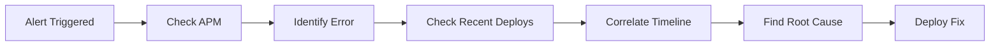
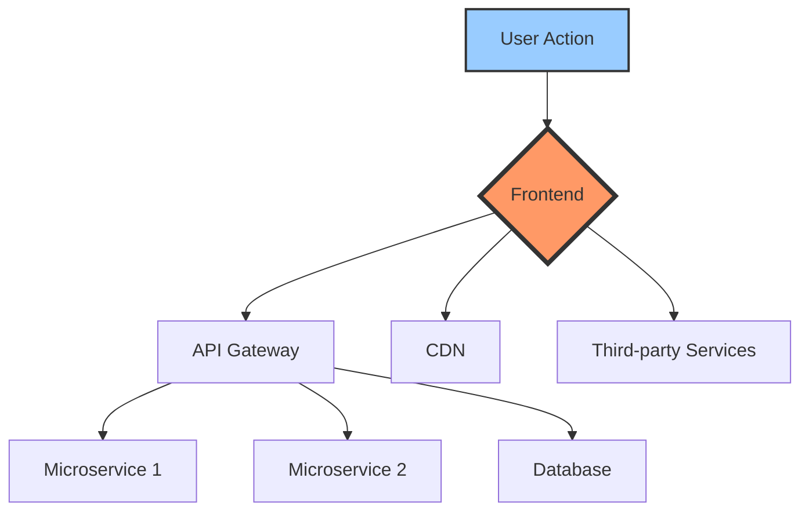
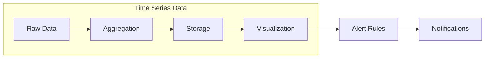
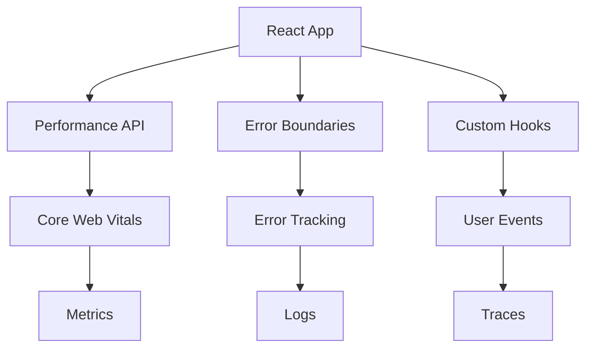
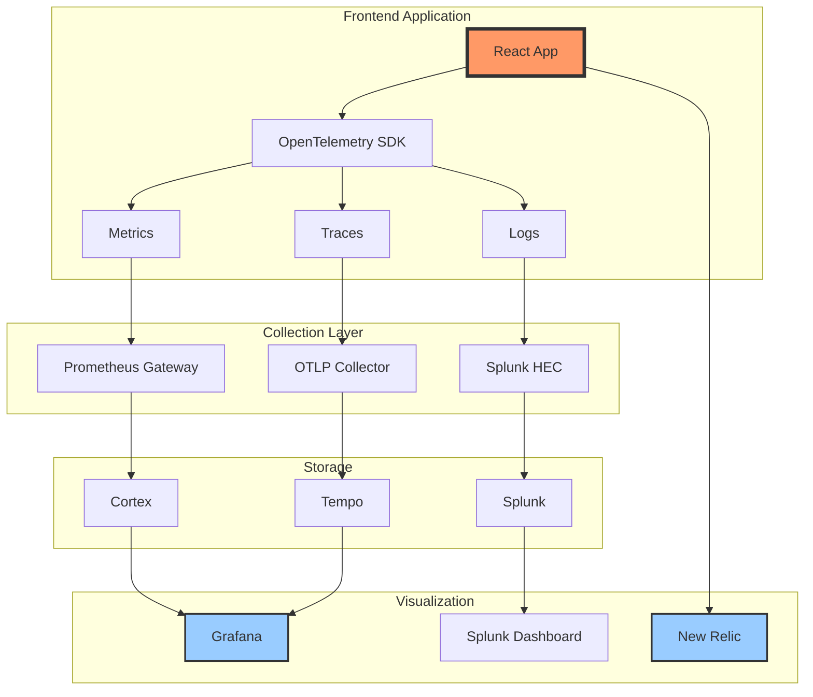
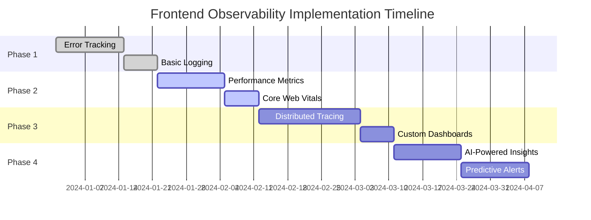

# Frontend Observability Odyssey

<div class="text-2xl text-gray-400 mb-4">
A journey through monitoring, telemetry, and real-world debugging
</div>

<div class="pt-12">
  <span @click="$slidev.nav.next" class="px-2 py-1 rounded cursor-pointer" hover="bg-white bg-opacity-10">
    Press Space to witness a live incident <carbon:arrow-right class="inline"/>
  </span>
</div>

<div class="abs-br m-6 flex gap-2">
  <a href="https://github.com" target="_blank" alt="GitHub" title="Open in GitHub"
    class="text-xl slidev-icon-btn opacity-50 !border-none !hover:text-white">
    <carbon-logo-github />
  </a>
</div>

---
layout: center
background: black
---

# 🚨 INCIDENT ALERT 🚨

<div v-click class="text-red-500 text-2xl animate-pulse mt-8">
  📱 PagerDuty Alert: Production Issue Detected
</div>

<div v-click class="mt-8 bg-red-900 bg-opacity-20 p-6 rounded-lg border border-red-500">
  <div class="text-sm text-gray-400">2024-01-15 09:47:23 UTC</div>
  <div class="text-xl mt-2">Smoke Test Failed: Checkout Flow</div>
  <div class="text-lg text-red-400 mt-2">Error Rate: 87% ↑</div>
  <div class="text-sm mt-4 text-gray-300">Last successful test: 5 minutes ago</div>
</div>

<div v-click class="mt-8 text-xl text-yellow-400">
  ⏱️ Time to Resolution: <span class="font-mono">00:00</span>
</div>

<!--
This is where we simulate receiving a real production alert.
The dramatic effect sets the stage for why observability matters.
-->

---
layout: two-cols
---

# The Investigation Begins

<div class="text-sm">

```js {1-10|11-15|16-20}
// 09:47:30 - Checking New Relic APM
const errorTrace = {
  timestamp: '2024-01-15T09:45:00Z',
  error: 'TypeError: Cannot read property "id" of undefined',
  location: 'CheckoutButton.jsx:42',
  browser: 'Chrome 120',
  impactedUsers: 1847,
  errorRate: 0.87,
  lastDeployment: '09:42:00Z'
}

// 09:47:45 - Checking deployment logs
deployments.recent = [
  { time: '09:42:00Z', commit: 'feat: add promo code validation' },
  { time: '08:15:00Z', commit: 'fix: update payment gateway SDK' }
]

// 09:48:00 - Found the issue!
// New promo code logic expects cartItems
// but doesn't handle empty carts
```

</div>

::right::

<div v-click class="ml-4">

## Real-time Dashboards



<div v-click class="mt-4 bg-green-900 bg-opacity-20 p-4 rounded">
  <div class="text-sm font-bold text-green-400">✅ Fix Deployed</div>
  <div class="text-xs mt-2">Time to Resolution: 3m 42s</div>
  <div class="text-xs">Customers Impacted: ~1,800</div>
  <div class="text-xs">Revenue Saved: ~$45,000</div>
</div>

</div>

---
layout: center
---

# What just happened?

<div class="text-2xl mt-8">
  We caught and fixed a critical bug in <span class="text-green-400 font-bold">under 4 minutes</span>
</div>

<div v-click class="mt-8 text-xl">
  Before customers noticed ✨
</div>

<div v-click class="mt-8 text-lg text-gray-400">
  This is the power of <span class="text-blue-400 font-bold">Frontend Observability</span>
</div>

---

# Today's Journey

<div class="grid grid-cols-2 gap-8 mt-8">

<div v-click>
  <div class="text-2xl mb-4">🔍 <span class="font-bold">What & Why</span></div>
  <ul class="space-y-2">
    <li>Observability vs Monitoring</li>
    <li>Why it's critical for modern web apps</li>
    <li>The cost of not having it</li>
  </ul>
</div>

<div v-click>
  <div class="text-2xl mb-4">📊 <span class="font-bold">Telemetry Types</span></div>
  <ul class="space-y-2">
    <li>Metrics - Aggregated data</li>
    <li>Events - Specific occurrences</li>
    <li>Logs - Detailed sequences</li>
    <li>Traces - Request journeys</li>
  </ul>
</div>

<div v-click>
  <div class="text-2xl mb-4">🛠️ <span class="font-bold">Tools & Demos</span></div>
  <ul class="space-y-2">
    <li>Splunk - Log aggregation</li>
    <li>Grafana Tempo - Distributed tracing</li>
    <li>Prometheus/Cortex - Metrics</li>
    <li>New Relic - APM</li>
  </ul>
</div>

<div v-click>
  <div class="text-2xl mb-4">🚀 <span class="font-bold">Future</span></div>
  <ul class="space-y-2">
    <li>OpenTelemetry standards</li>
    <li>Best practices</li>
    <li>Implementation guide</li>
  </ul>
</div>

</div>

---
layout: section
---

# Part 1: Understanding Observability

<div class="text-xl text-gray-400 mt-4">
  The foundation of resilient systems
</div>

---

# Monitoring vs Observability

<div class="grid grid-cols-2 gap-8 mt-8">

<div>
  <h3 class="text-2xl mb-4 text-blue-400">Monitoring 📊</h3>
  <div class="space-y-3">
    <div v-click>✓ Watches known metrics</div>
    <div v-click>✓ Alerts on thresholds</div>
    <div v-click>✓ Answers "What happened?"</div>
    <div v-click>✓ Predefined dashboards</div>
  </div>
</div>

<div>
  <h3 class="text-2xl mb-4 text-green-400">Observability 🔍</h3>
  <div class="space-y-3">
    <div v-click>✓ Explores unknown issues</div>
    <div v-click>✓ Provides deep insights</div>
    <div v-click>✓ Answers "Why it happened?"</div>
    <div v-click>✓ Dynamic investigation</div>
  </div>
</div>

</div>

<div v-click class="mt-12 p-6 bg-gray-800 rounded-lg">
  <div class="text-center text-xl">
    <span class="text-blue-400">Monitoring</span> tells you when your house is on fire 🔥
    <br/>
    <span class="text-green-400">Observability</span> helps you find what started it 🔍
  </div>
</div>

---

# Why Frontend Observability?

<div class="mt-8">



</div>

<div class="grid grid-cols-3 gap-4 mt-8">
  <div v-click class="bg-red-900 bg-opacity-20 p-4 rounded">
    <div class="text-lg font-bold">Browser Diversity</div>
    <div class="text-sm">Chrome, Safari, Firefox, Edge...</div>
  </div>
  <div v-click class="bg-yellow-900 bg-opacity-20 p-4 rounded">
    <div class="text-lg font-bold">Network Variability</div>
    <div class="text-sm">3G, 4G, WiFi, Corporate proxies</div>
  </div>
  <div v-click class="bg-blue-900 bg-opacity-20 p-4 rounded">
    <div class="text-lg font-bold">Device Fragmentation</div>
    <div class="text-sm">Mobile, Desktop, Tablet, IoT</div>
  </div>
</div>

---
layout: section
---

# Part 2: Telemetry Data Types

<div class="text-xl text-gray-400 mt-4">
  The four pillars of observability
</div>

---

# The Four Pillars of Telemetry

<div class="grid grid-cols-2 gap-8 mt-8">

<div v-click>
  <div class="bg-blue-900 bg-opacity-20 p-6 rounded-lg border border-blue-500">
    <h3 class="text-2xl mb-2">📊 Metrics</h3>
    <p class="text-sm">Aggregated numerical data over time</p>
    <div class="mt-4 text-xs">
      <code>page_load_time_seconds{page="/checkout"} 2.34</code>
    </div>
  </div>
</div>

<div v-click>
  <div class="bg-green-900 bg-opacity-20 p-6 rounded-lg border border-green-500">
    <h3 class="text-2xl mb-2">📌 Events</h3>
    <p class="text-sm">Discrete occurrences with context</p>
    <div class="mt-4 text-xs">
      <code>user.clicked_button{id="buy-now", timestamp="..."}</code>
    </div>
  </div>
</div>

<div v-click>
  <div class="bg-yellow-900 bg-opacity-20 p-6 rounded-lg border border-yellow-500">
    <h3 class="text-2xl mb-2">📝 Logs</h3>
    <p class="text-sm">Detailed timestamped records</p>
    <div class="mt-4 text-xs">
      <code>[ERROR] 2024-01-15 Payment failed: Invalid card</code>
    </div>
  </div>
</div>

<div v-click>
  <div class="bg-purple-900 bg-opacity-20 p-6 rounded-lg border border-purple-500">
    <h3 class="text-2xl mb-2">🔗 Traces</h3>
    <p class="text-sm">Request flow across services</p>
    <div class="mt-4 text-xs">
      <code>TraceID: abc123 → Frontend → API → DB</code>
    </div>
  </div>
</div>

</div>

---

# Metrics: The Pulse of Your App

<div class="grid grid-cols-2 gap-8">

<div>

### What to measure?

```js
// Core Web Vitals
const metrics = {
  LCP: 2.5,  // Largest Contentful Paint
  FID: 100,  // First Input Delay
  CLS: 0.1,  // Cumulative Layout Shift
  
  // Business Metrics
  conversionRate: 0.034,
  cartAbandonment: 0.68,
  errorRate: 0.002,
  
  // Technical Metrics
  jsHeapSize: 45.2, // MB
  apiLatency: 234,  // ms
  cacheHitRate: 0.89
}
```

</div>

<div v-click>

### Visualization Example



<div class="mt-4 text-sm bg-blue-900 bg-opacity-20 p-4 rounded">
  💡 <strong>Pro Tip:</strong> Track both technical and business metrics to get the full picture
</div>

</div>

</div>

---

# Events: User Journey Tracking

```js {all|1-10|12-20|22-30}
// Event tracking implementation
class EventTracker {
  track(eventName, properties = {}) {
    const event = {
      name: eventName,
      timestamp: new Date().toISOString(),
      sessionId: this.getSessionId(),
      userId: this.getUserId(),
      properties: {
        ...properties,
        // Automatic context
        url: window.location.href,
        userAgent: navigator.userAgent,
        viewport: {
          width: window.innerWidth,
          height: window.innerHeight
        }
      }
    };
    
    // Send to analytics service
    this.send(event);
  }
}

// Usage
tracker.track('product_viewed', {
  productId: 'SKU-12345',
  category: 'Electronics',
  price: 299.99,
  currency: 'USD'
});
```

---

# Logs: Your Debugging Lifeline

<div class="grid grid-cols-2 gap-4">

<div>

### Structured Logging

```js
// Bad ❌
console.log('Error in checkout');

// Good ✅
logger.error('Checkout failed', {
  error: err.message,
  stack: err.stack,
  context: {
    userId: user.id,
    cartId: cart.id,
    items: cart.items.length,
    total: cart.total
  },
  breadcrumbs: [
    'user.login',
    'cart.add_item',
    'checkout.start',
    'payment.process'
  ]
});
```

</div>

<div v-click>

### Log Levels & Context

```js
const LogLevel = {
  DEBUG: 0,   // Dev environment only
  INFO: 1,    // General information
  WARN: 2,    // Potential issues
  ERROR: 3,   // Errors that need attention
  FATAL: 4    // App-breaking errors
};

// Contextual logging
class Logger {
  constructor(context) {
    this.context = context;
  }
  
  error(message, meta = {}) {
    this.log('ERROR', message, {
      ...this.context,
      ...meta,
      timestamp: Date.now()
    });
  }
}
```

</div>

</div>

---

# Traces: Following the Request Journey

```mermaid {theme: 'dark', scale: 0.9}
gantt
    title Distributed Trace Timeline
    dateFormat X
    axisFormat %L ms
    
    section Frontend
    Page Load           :0, 100
    API Call           :100, 250
    
    section API Gateway
    Auth Check         :100, 120
    Route Request      :120, 130
    
    section User Service
    Fetch User Data    :130, 180
    
    section Order Service
    Get Orders         :180, 240
    
    section Database
    Query Execution    :190, 230
```



<div class="mt-8">

```js
// Implementing tracing in frontend
import { trace } from '@opentelemetry/api';

const tracer = trace.getTracer('frontend-app');

async function fetchUserOrders(userId) {
  const span = tracer.startSpan('fetch-user-orders');
  span.setAttributes({ userId, timestamp: Date.now() });
  
  try {
    const orders = await api.getOrders(userId);
    span.setStatus({ code: SpanStatusCode.OK });
    return orders;
  } catch (error) {
    span.recordException(error);
    span.setStatus({ code: SpanStatusCode.ERROR });
    throw error;
  } finally {
    span.end();
  }
}
```

</div>

---
layout: section
---

# Part 3: Live Demonstrations

<div class="text-xl text-gray-400 mt-4">
  Seeing observability in action
</div>

---

# Demo Setup: E-Commerce App

<div class="grid grid-cols-2 gap-8">

<div>

### Our Demo Application

```js
// App structure
const DemoApp = {
  frontend: 'React + TypeScript',
  api: 'Node.js Express',
  database: 'PostgreSQL',
  
  features: [
    'Product browsing',
    'Shopping cart',
    'Checkout flow',
    'Payment processing'
  ],
  
  instrumentation: {
    metrics: 'Prometheus',
    logs: 'Splunk',
    traces: 'Grafana Tempo',
    apm: 'New Relic'
  }
};
```

</div>

<div>

### Instrumentation Points



</div>

</div>

---

# Demo 1: Splunk - Log Aggregation

<div class="grid grid-cols-2 gap-4">

<div>

### Setting up Splunk Forwarder

```js
// Splunk HTTP Event Collector
class SplunkLogger {
  constructor(config) {
    this.endpoint = config.endpoint;
    this.token = config.token;
  }
  
  async log(level, message, context) {
    const event = {
      time: Date.now() / 1000,
      host: window.location.hostname,
      source: 'frontend',
      sourcetype: 'javascript',
      event: {
        level,
        message,
        ...context,
        browser: this.getBrowserInfo(),
        session: this.getSessionId()
      }
    };
    
    await fetch(this.endpoint, {
      method: 'POST',
      headers: {
        'Authorization': `Splunk ${this.token}`,
        'Content-Type': 'application/json'
      },
      body: JSON.stringify(event)
    });
  }
}
```

</div>

<div v-click>

### Search Queries

```sql
-- Find all checkout errors
index=frontend 
source=javascript 
level=ERROR 
message="*checkout*" 
| stats count by browser

-- User journey analysis
index=frontend 
sessionId="abc123" 
| sort time 
| table time, event.action, event.page

-- Performance degradation
index=frontend 
metric="page_load_time" 
| timechart avg(value) by page
```

<div class="mt-4 bg-blue-900 bg-opacity-20 p-3 rounded text-sm">
💡 Live Demo: Let's search for our earlier incident!
</div>

</div>

</div>

---

# Demo 2: Grafana Tempo - Distributed Tracing

```js {all|1-15|17-35}
// Implementing OpenTelemetry in React
import { WebTracerProvider } from '@opentelemetry/sdk-trace-web';
import { ZoneContextManager } from '@opentelemetry/context-zone';
import { FetchInstrumentation } from '@opentelemetry/instrumentation-fetch';

const provider = new WebTracerProvider();
provider.addSpanProcessor(
  new BatchSpanProcessor(
    new OTLPTraceExporter({
      url: 'http://tempo:4318/v1/traces',
    })
  )
);

provider.register({
  contextManager: new ZoneContextManager()
});

// Custom React Hook for tracing
export function useTracing() {
  const tracer = trace.getTracer('frontend-app');
  
  const traceAsync = useCallback(async (name, fn) => {
    const span = tracer.startSpan(name);
    const ctx = trace.setSpan(context.active(), span);
    
    try {
      const result = await context.with(ctx, fn);
      span.setStatus({ code: SpanStatusCode.OK });
      return result;
    } catch (error) {
      span.recordException(error);
      span.setStatus({ code: SpanStatusCode.ERROR });
      throw error;
    } finally {
      span.end();
    }
  }, [tracer]);
  
  return { traceAsync };
}
```

---

# Demo 3: Prometheus/Cortex - Metrics

<div class="grid grid-cols-2 gap-4">

<div>

### Exposing Frontend Metrics

```js
// Custom metrics collector
class MetricsCollector {
  constructor() {
    this.metrics = new Map();
    this.startCollection();
  }
  
  startCollection() {
    // Core Web Vitals
    new PerformanceObserver((list) => {
      for (const entry of list.getEntries()) {
        this.record('lcp', entry.startTime);
      }
    }).observe({ entryTypes: ['largest-contentful-paint'] });
    
    // Custom business metrics
    this.record('cart_items', getCartCount());
    this.record('api_errors', getErrorCount());
  }
  
  async pushToGateway() {
    const metrics = this.formatPrometheus();
    await fetch('/metrics-gateway', {
      method: 'POST',
      body: metrics
    });
  }
}
```

</div>

<div v-click>

### Grafana Dashboard

```yaml
# Dashboard config
panels:
  - title: "Page Load Time"
    query: |
      histogram_quantile(0.95,
        rate(page_load_duration_bucket[5m])
      )
      
  - title: "Error Rate"
    query: |
      sum(rate(frontend_errors_total[5m]))
      / sum(rate(frontend_requests_total[5m]))
      
  - title: "Core Web Vitals"
    queries:
      - metric: "lcp_score"
      - metric: "fid_score"
      - metric: "cls_score"
```

<div class="mt-4 text-sm bg-green-900 bg-opacity-20 p-3 rounded">
🎯 Live Demo: Real-time metrics visualization
</div>

</div>

</div>

---

# Demo 4: New Relic - Application Monitoring

```js {all|1-20|22-40}
// New Relic Browser Agent Setup
import { BrowserAgent } from '@newrelic/browser-agent/loaders/browser-agent'

const options = {
  init: {
    distributed_tracing: { enabled: true },
    privacy: { cookies_enabled: true },
    ajax: { 
      enabled: true,
      harvestTimeSeconds: 10,
      autoStart: true
    },
    page_view_timing: { enabled: true },
    session_replay: {
      enabled: true,
      harvestTimeSeconds: 30,
      sampling_rate: 0.1,
      error_sampling_rate: 1.0
    }
  },
  info: {
    beacon: 'bam.nr-data.net',
    errorBeacon: 'bam.nr-data.net',
    licenseKey: 'YOUR_LICENSE_KEY',
    applicationID: 'YOUR_APP_ID',
    sa: 1
  },
  loader_config: {
    accountID: 'YOUR_ACCOUNT_ID',
    trustKey: 'YOUR_TRUST_KEY',
    agentID: 'YOUR_AGENT_ID',
    licenseKey: 'YOUR_LICENSE_KEY',
    applicationID: 'YOUR_APP_ID'
  }
}

// Initialize the agent
const agent = new BrowserAgent(options)

// Custom error handling
window.addEventListener('error', (event) => {
  agent.noticeError(event.error, {
    custom: {
      userAction: getUserLastAction(),
      sessionDuration: getSessionDuration()
    }
  });
});
```

---

# Bringing It All Together



---
layout: section
---

# Part 4: OpenTelemetry

<div class="text-xl text-gray-400 mt-4">
  The future of observability standards
</div>

---

# OpenTelemetry: Unified Standards

<div class="grid grid-cols-2 gap-8 mt-8">

<div>

### What is OpenTelemetry?

- 🌐 **Vendor-neutral** observability framework
- 📊 **Unified APIs** for metrics, traces, and logs
- 🔄 **Auto-instrumentation** capabilities
- 🎯 **Single standard** for all telemetry data

### Benefits

<div v-click class="mt-4 space-y-2 text-sm">
<div>✅ No vendor lock-in</div>
<div>✅ Consistent instrumentation</div>
<div>✅ Community-driven</div>
<div>✅ Future-proof</div>
</div>

</div>

<div v-click>

### Implementation Example

```js
// One SDK to rule them all
import { NodeSDK } from '@opentelemetry/sdk-node';
import { getNodeAutoInstrumentations } from 
  '@opentelemetry/auto-instrumentations-node';

const sdk = new NodeSDK({
  traceExporter: new OTLPTraceExporter({
    url: 'http://localhost:4318/v1/traces',
  }),
  metricReader: new PeriodicExportingMetricReader({
    exporter: new OTLPMetricExporter({
      url: 'http://localhost:4318/v1/metrics',
    }),
  }),
  instrumentations: [
    getNodeAutoInstrumentations({
      '@opentelemetry/instrumentation-fs': {
        enabled: false,
      },
    }),
  ],
});

sdk.start();
```

</div>

</div>

---

# Best Practices & Lessons Learned

<div class="grid grid-cols-2 gap-6 mt-6">

<div>

### Do's ✅

```js
// 1. Use structured logging
logger.info('Order completed', {
  orderId: order.id,
  amount: order.total,
  items: order.items.length,
  duration: performance.now() - startTime
});

// 2. Add context to errors
try {
  await processPayment(order);
} catch (error) {
  error.context = {
    orderId: order.id,
    paymentMethod: order.paymentMethod,
    attemptNumber: retryCount
  };
  throw error;
}

// 3. Sample appropriately
if (Math.random() < 0.1) { // 10% sampling
  telemetry.recordTrace(span);
}
```

</div>

<div>

### Don'ts ❌

```js
// 1. Don't log sensitive data
logger.info('User login', {
  email: user.email,
  password: '***' // NEVER log passwords!
});

// 2. Avoid high-cardinality labels
metrics.record('api_call', {
  userId: user.id, // Bad: millions of values
  endpoint: '/api/users' // Good: limited set
});

// 3. Don't ignore performance impact
// Bad: Logging in tight loops
for (let item of items) {
  logger.debug('Processing item', item); // 🔥
}

// Good: Aggregate then log
logger.debug('Processed items', { 
  count: items.length 
});
```

</div>

</div>

---

# Implementation Roadmap

<div class="mt-8">



</div>

<div class="grid grid-cols-3 gap-4 mt-8 text-sm">
  <div class="bg-blue-900 bg-opacity-20 p-4 rounded">
    <div class="font-bold">Week 1-3</div>
    <div>Foundation: Errors & Logs</div>
  </div>
  <div class="bg-green-900 bg-opacity-20 p-4 rounded">
    <div class="font-bold">Week 4-6</div>
    <div>Performance & Metrics</div>
  </div>
  <div class="bg-purple-900 bg-opacity-20 p-4 rounded">
    <div class="font-bold">Week 7-12</div>
    <div>Advanced Features</div>
  </div>
</div>

---
layout: center
---

# Key Takeaways

<div class="text-left max-w-2xl mx-auto mt-8 space-y-6">

<div v-click class="flex items-start gap-4">
  <div class="text-3xl">🎯</div>
  <div>
    <div class="font-bold text-xl">Start Simple</div>
    <div class="text-gray-400">Begin with error tracking and basic metrics</div>
  </div>
</div>

<div v-click class="flex items-start gap-4">
  <div class="text-3xl">📊</div>
  <div>
    <div class="font-bold text-xl">Measure What Matters</div>
    <div class="text-gray-400">Focus on metrics that impact user experience</div>
  </div>
</div>

<div v-click class="flex items-start gap-4">
  <div class="text-3xl">🔍</div>
  <div>
    <div class="font-bold text-xl">Context is King</div>
    <div class="text-gray-400">Rich context makes debugging 10x faster</div>
  </div>
</div>

<div v-click class="flex items-start gap-4">
  <div class="text-3xl">🚀</div>
  <div>
    <div class="font-bold text-xl">Automate Everything</div>
    <div class="text-gray-400">Let tools do the heavy lifting</div>
  </div>
</div>

</div>

---
layout: center
class: text-center
---

# Thank You! 🙏

<div class="text-2xl mt-8 mb-4">Questions?</div>

<div class="flex justify-center gap-8 mt-12">
  <a href="https://github.com" class="flex items-center gap-2">
    <carbon-logo-github class="text-2xl" />
    <span>GitHub</span>
  </a>
  <a href="https://twitter.com" class="flex items-center gap-2">
    <carbon-logo-twitter class="text-2xl" />
    <span>Twitter</span>
  </a>
  <a href="https://linkedin.com" class="flex items-center gap-2">
    <carbon-logo-linkedin class="text-2xl" />
    <span>LinkedIn</span>
  </a>
</div>

<div class="mt-12 text-sm text-gray-400">
  Slides and demo code available at: github.com/yourusername/frontend-observability-odyssey
</div>

---
layout: section
---

# Bonus: Resources & Links

<div class="text-lg text-gray-400 mt-4">
  Continue your observability journey
</div>

---

# Resources

<div class="grid grid-cols-2 gap-8">

<div>

### Documentation
- 📚 [OpenTelemetry Docs](https://opentelemetry.io/docs/)
- 📊 [Prometheus Best Practices](https://prometheus.io/docs/practices/)
- 🔍 [Grafana Tutorials](https://grafana.com/tutorials/)
- 📝 [Splunk Search Reference](https://docs.splunk.com/Documentation)

### Tools
- 🛠️ [Web Vitals Library](https://github.com/GoogleChrome/web-vitals)
- 📈 [Lighthouse CI](https://github.com/GoogleChrome/lighthouse-ci)
- 🔧 [Sentry JavaScript SDK](https://docs.sentry.io/platforms/javascript/)

</div>

<div>

### Books & Articles
- 📖 "Observability Engineering" - O'Reilly
- 📰 "The Three Pillars of Observability" - Honeycomb
- 📄 "Frontend Performance Monitoring" - web.dev

### Community
- 💬 [CNCF Slack](https://slack.cncf.io/)
- 🌐 [Observability Practitioners](https://o11y.community/)
- 🎯 [Frontend Performance Group](https://www.meetup.com/topics/front-end-performance/)

</div>

</div>

<div class="mt-8 p-4 bg-blue-900 bg-opacity-20 rounded-lg text-center">
  🚀 Start small, iterate fast, and remember: <br/>
  <span class="text-xl font-bold">You can't fix what you can't see!</span>
</div>